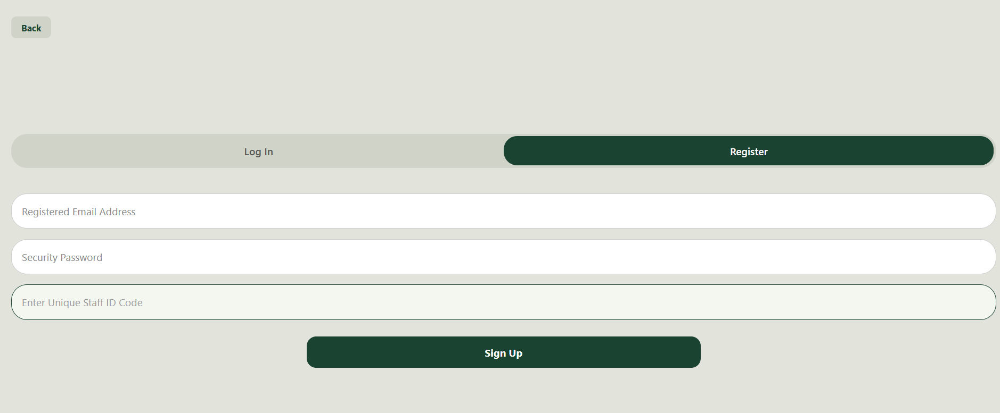
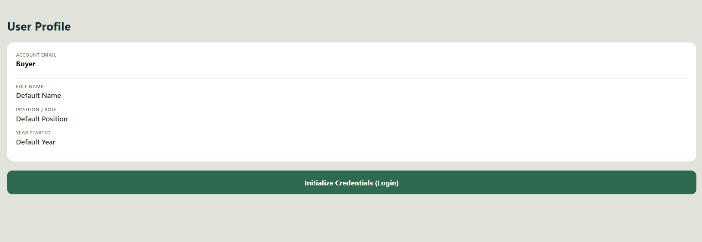
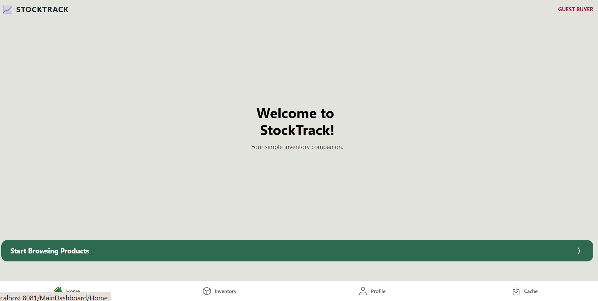
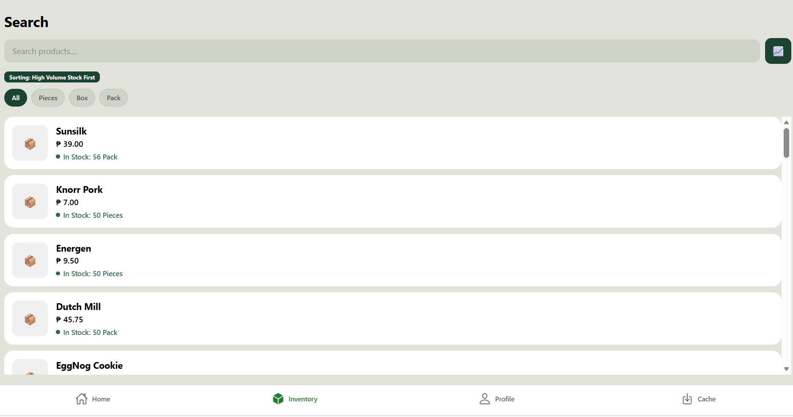
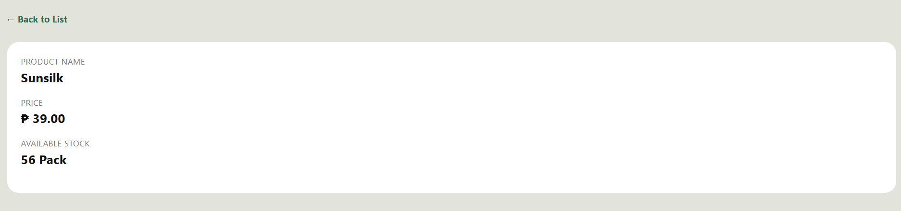
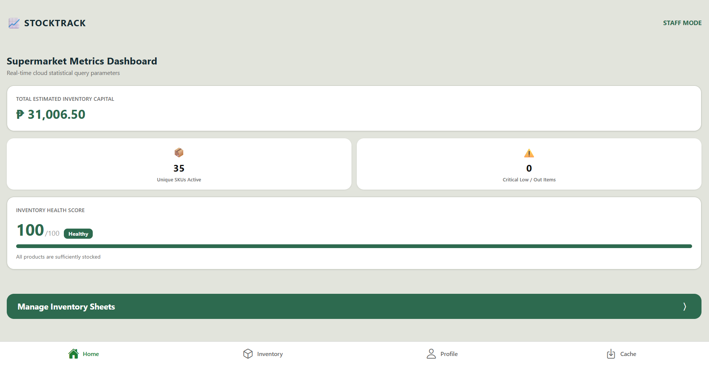
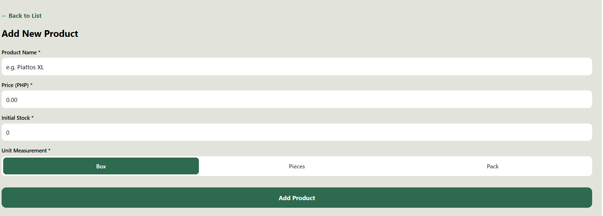
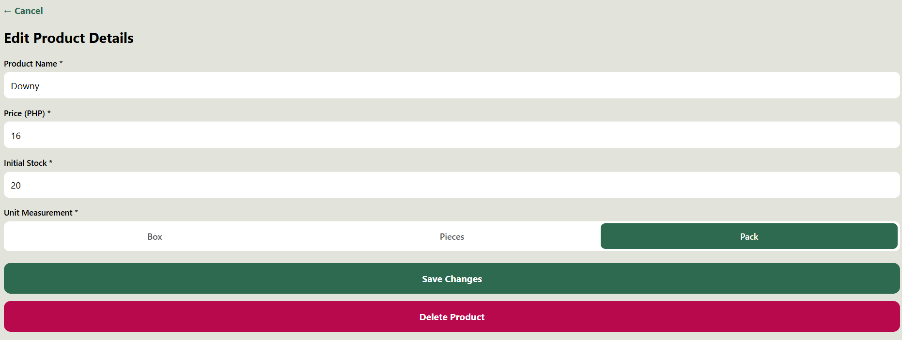
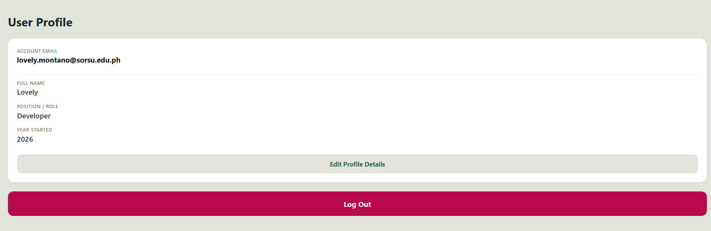
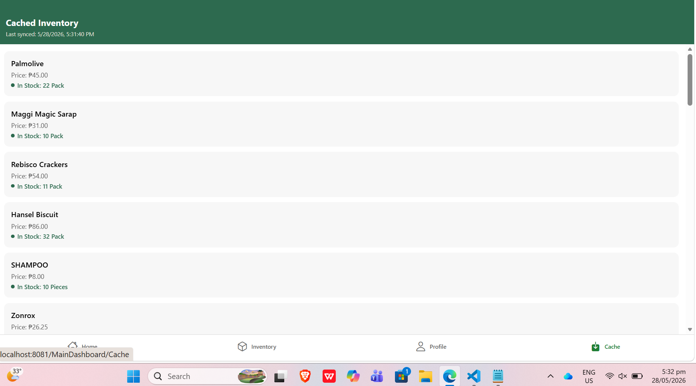

# 📈 StockTrack
### ADET 2 — Mobile Application Project | Expo + React Native + Firebase Firestore

A cross-platform mobile inventory management app built for small supermarkets and retail stores. Staff can track product stock levels in real time, receive push notifications for low-stock events, and view an analytics dashboard. Guest buyers can browse the full product catalog without creating an account.

---

## Midterm MVP vs Final Feature List

| Feature | Midterm MVP | Final |
|---|---|---|
| Firebase Auth (Register / Login / Logout / Forgot Password) | ✅ | ✅ |
| Role-based access: Guest vs Staff | ✅ | ✅ (abstracted into `useUserRole` custom hook) |
| Firestore CRUD on `products` collection | ✅ | ✅ |
| Real-time product list via `onSnapshot` | ✅ | ✅ |
| Search, filter by unit, sort by stock | ✅ | ✅ |
| Product detail view (public) | ✅ | ✅ |
| Add product with duplicate name validation | ✅ | ✅ |
| Edit / Delete product with confirmation modal | ✅ | ✅ |
| Staff profile (editable name, position, year) | ✅ | ✅ |
| Loading, empty, and error states | ✅ | ✅ |
| Push notifications (out-of-stock / low stock / restock) | — | ✅ `expo-notifications` |
| Offline-first local cache with last-sync timestamp | — | ✅ `AsyncStorage` + `persistentLocalCache()` |
| Analytics dashboard with Inventory Health Score | — | ✅ Staff-only HomeScreen |
| Firestore Security Rules (public read, auth writes, owner-only users) | — | ✅ Deployed on Firebase Console |
| Reusable `StockBadge` component | — | ✅ `components/StockBadge.js` |
| `useUserRole` custom hook | — | ✅ `hooks/useUserRole.js` |

---

## Architecture Overview

```
StockTrack/
├── src/
│   ├── config/
│   │   └── firebase.js               # Firebase app, auth (AsyncStorage persistence),
│   │                                 # Firestore (persistentLocalCache), storage
│   ├── navigation/
│   │   └── AppNavigator.js           # Root Stack → MainTabs (Bottom Tab: Home, Inventory, Profile, Cache)
│   ├── screens/
│   │   ├── HomeScreen.js             # Guest welcome OR Staff analytics dashboard
│   │   ├── ExploreScreen.js          # Product list — search, filter, sort
│   │   ├── DetailScreen.js           # Public product detail view
│   │   ├── AddProductScreen.js       # Staff — add product with duplicate name check
│   │   ├── ManageInventoryScreen.js  # Staff — edit and delete product
│   │   ├── ProfileScreen.js          # Staff profile editor + logout
│   │   ├── AuthScreen.js             # Register / Login / Forgot Password
│   │   └── CachedInventoryScreen.js  # Offline view — cached products + last-sync timestamp
│   ├── services/
│   │   ├── productService.js         # Firestore CRUD + real-time onSnapshot subscription
│   │   ├── authService.js            # Register, login, logout, role lookup, password reset
│   │   ├── cacheService.js           # AsyncStorage save, retrieve, last-sync timestamp
│   │   └── notificationService.js    # expo-notifications permission + stock alert triggers
│   ├── hooks/
│   │   └── useUserRole.js            # Custom hook: fetches user role on screen focus
│   └── components/
│       └── StockBadge.js             # Reusable stock indicator — dot + label (3 states)
├── assets/                           # App icons and splash screen
├── app.config.js                     # Expo config with expo-notifications plugin
├── eas.json                          # EAS Build profiles (preview APK)
└── babel.config.js                   # Babel preset + react-native-dotenv plugin
```

**State approach:** Local `useState` per screen. No global state manager — Firebase `onSnapshot` listeners serve as the reactive data layer. Shared logic lives in `hooks/`, reusable UI in `components/`.

**Navigation:** Root `Stack.Navigator` mounts `MainTabs` (Bottom Tab: Home, Inventory, Profile, Cache) as the initial route. Auth, Detail, AddProduct, and ManageInventory screens are stack-pushed on top.

---

## Firebase Configuration Approach

Firebase credentials are stored in a `.env` file at the project root and are **never committed** to the repository (`.env` and `google-services.json` are both listed in `.gitignore`).

The `firebase.js` config file uses hardcoded values in the source (these are web-safe, client-side Firebase config keys — not secret server keys). For production deployment, credentials should be fully migrated to EAS Secrets via the `@env` import already wired in `babel.config.js`.

```js
// src/config/firebase.js — simplified overview
const app = initializeApp(firebaseConfig);

// Auth with AsyncStorage persistence on native
const auth = Platform.OS === 'web'
  ? initializeAuth(app, { persistence: browserLocalPersistence })
  : initializeAuth(app, { persistence: getReactNativePersistence(AsyncStorage) });

// Firestore with persistent offline cache on native
const db = Platform.OS === 'web'
  ? getFirestore(app)
  : initializeFirestore(app, { localCache: persistentLocalCache() });
```

---

## Firestore Collections

### `products` — publicly readable

| Field | Type | Description |
|---|---|---|
| `name` | string | Product name, unique (case-insensitive check enforced on create and update) |
| `price` | number | Unit price in Philippine Peso (PHP) |
| `stock` | number | Current stock quantity |
| `unit` | string | Unit of measurement: Box, Pieces, or Pack |
| `createdAt` | timestamp | Auto-set on create via `serverTimestamp()` |
| `updatedAt` | timestamp | Auto-updated on every edit via `serverTimestamp()` |

**Sample document:**
```json
{
  "name": "Palmolive",
  "price": 45,
  "stock": 23,
  "unit": "Pack",
  "createdAt": "May 27, 2026 at 10:54:45 AM UTC+8",
  "updatedAt": "May 27, 2026 at 1:15:38 PM UTC+8"
}
```

### `users` — private (owner-only access)

| Field | Type | Description |
|---|---|---|
| `email` | string | Registered email address |
| `role` | string | Always `staff` — registered accounts are staff by design; guests browse anonymously |

**Sample document:**
```json
{
  "email": "lovely.montano@sorsu.edu.ph",
  "role": "staff"
}
```

---

## Firestore Security Rules

```
rules_version = '2';
service cloud.firestore {
  match /databases/{database}/documents {

    match /products/{productId} {
      allow read: if true;
      allow create, update, delete: if request.auth != null;
    }

    match /users/{userId} {
      allow read, write: if request.auth != null && request.auth.uid == userId;
    }
  }
}
```

**Summary:**
- `products` is publicly readable — any guest can browse without logging in
- Only authenticated users (staff) can create, update, or delete products
- `users` documents are fully private — each document is only accessible by the user whose Firebase UID matches the document ID

---

## Setup Instructions

### Prerequisites
- Node.js v20 LTS (v24 has a known eas-cli prompt incompatibility)
- EAS CLI: `npm install -g eas-cli`

### 1. Clone the repository
```bash
git clone https://github.com/secretngani/StockTrack.git
cd StockTrack
```

### 2. Install dependencies
```bash
npm install
```

### 3. Configure environment variables
Create a `.env` file in the root (never commit this file):
```
FIREBASE_API_KEY=your_api_key
FIREBASE_AUTH_DOMAIN=your_project.firebaseapp.com
FIREBASE_PROJECT_ID=your_project_id
FIREBASE_STORAGE_BUCKET=your_project.firebasestorage.app
FIREBASE_MESSAGING_SENDER_ID=your_sender_id
FIREBASE_APP_ID=your_app_id
```

### 4. Run in development
```bash
npx expo start
```

### 5. Build APK
```bash
eas build --platform android --profile preview --clear-cache
```

### 6. Tag the release
```bash
git tag v1.0.0
git push origin v1.0.0
```

---

## Build Instructions

| Command | Purpose |
|---|---|
| `eas build --platform android --profile preview --clear-cache` | Build internal APK for testing |
| `eas build --platform android --profile production` | Build production AAB for Play Store |

Current release: **v1.0.0**

---

### 1. Guest Buyer Interface Test Cases

| TESTID | Module | Description | Expected Result | Actual Result | Status |
| :--- | :--- | :--- | :--- | :--- | :--- |
| **TC-001** | Guest Dashboard | Open the “StockTrack” app, load it to the guest dashboard(Home).[cite: 3] | Loads to “Guest Buyer” Mode[cite: 3] | Correctly loads to “Guest Buyer” mode with welcome messages.[cite: 3] | PASSED |
| **TC-002** | Browsing | Click the “Start Browsing Products (Home)”[cite: 3] | Loads the list of available products and quantity[cite: 3] | Loads the full catalog list showing item configurations and counts.[cite: 3] | PASSED |
| **TC-003** | Searching | Click “Search Products”, and type the product name (Inventory).[cite: 3] | Correctly match the search product[cite: 3] | Accurately narrows the list down to the matched string.[cite: 3] | PASSED |
| **TC-004** | Sorting | Click the icon beside the search bar” for sorting.[cite: 3] | It is sorted from “Critical Low Stock First”, and when clicked twice it sorts to “High Volume Stock First”.[cite: 3] | Products reorder sequentially matching the active toggle command.[cite: 3] | PASSED |
| **TC-005** | Sorting | Click “Pieces”.[cite: 3] | It shows the stocks that’s available in “Pieces”[cite: 3] | Filters and displays catalog items matching the selected unit.[cite: 3] | PASSED |
| **TC-006** | Filtering | Click “Box”[cite: 3] | It shows the stocks that’s available in “Box”[cite: 3] | Filters out other formats to show items in Box units only.[cite: 3] | PASSED |
| **TC-007** | Filtering | Click “Pack”[cite: 3] | It shows the products available in “Pack”[cite: 3] | Successfully keeps items using the Pack measurement unit.[cite: 3] | PASSED |
| **TC-008** | Profile | Click “Profile” features.[cite: 3] | Shows the default profile for guest buyer[cite: 3] | Renders a fallback profile layout with a clear Login CTA button.[cite: 3] | PASSED |
| **TC-009** | Login page | Click the “Initialized Credentials) Login” button.[cite: 3] | Show the login page[cite: 3] | Pulls up the tabbed Authentication interface layout smoothly.[cite: 3] | PASSED |
| **TC-010** | Register page | Click the “Initialized Credentials) Login” button, select register.[cite: 3] | Show the register page[cite: 3] | Successfully transitions focus over to the registration screen view.[cite: 3] | PASSED |
| **TC-011** | Cached Inventory | Click the “Cache” features[cite: 3] | Load the cached inventory[cite: 3] | Shows the local AsyncStorage backup list along with the last-sync time.[cite: 3] | PASSED |
| **TC-012** | View Product | Go to “Inventory”, select any products in the list.[cite: 3] | Show the product detail(name, price and stock)[cite: 3] | Displays the read-only screen showing names, prices, and stocks without editing buttons.[cite: 3] | PASSED |

***

### 2. Staff Mode Test Cases

| TESTID | Module | Description | Expected Result | Actual Result | Status |
| :--- | :--- | :--- | :--- | :--- | :--- |
| **TC-013** | User Authentication | User registers with valid email and password.[cite: 3] | Account created successfully, user logged in.[cite: 3] | Registration registers user and auto-routes to dashboard.[cite: 3] | PASSED |
| **TC-014** | User Authentication | The user logs in with correct credentials.[cite: 3] | User authenticated and directed to dashboard.[cite: 3] | Grants application entrance and logs profile into Staff Mode.[cite: 3] | PASSED |
| **TC-015** | User Authentication | The user logs in with an incorrect password.[cite: 3] | Error message display, Log in denied.[cite: 3] | Blocks backend authentication access and drops an explicit error.[cite: 3] | PASSED |
| **TC-016** | Account Recovery | Staff clicks the "Forgot Password" link on the Auth screen and types their email.[cite: 2] | Reset password link is generated and sent to the registered email address.[cite: 2] | Generates confirmation pop-up and dispatches recovery link to email.[cite: 2] | PASSED |
| **TC-017** | Inventory Management | Staff adds a new item with complete details[cite: 3] | Item saved to database and appears in list[cite: 3] | Product entry is written directly into Firestore and shows instantly.[cite: 3] | PASSED |
| **TC-018** | Inventory Management | Staff edits details of an existing item[cite: 3] | Item information updated successfully.[cite: 3] | Commits modifications successfully across linked screens.[cite: 3] | PASSED |
| **TC-019** | Inventory Management | Staff deletes an item permanently[cite: 3] | Item record removed from database[cite: 3] | Drops the item out of the Firestore collection completely after confirmation.[cite: 3] | PASSED |
| **TC-020** | Sorting & Filtering | Staff selects “High Volume Stock first”[cite: 3] | Items sorted by highest quantity displayed at top[cite: 3] | Instantly targets higher stock figures and floats them upward.[cite: 3] | PASSED |
| **TC-021** | Sorting & Filtering | Staff selects “Critical Low Stock First“[cite: 3] | Items with lowest quantity displayed at top.[cite: 3] | Rearranges order to reveal low-volume entries right at the top.[cite: 3] | PASSED |
| **TC-022** | Data Sync | Staff adds item on Device A, checks on Device B[cite: 3] | A new item appears on Device B in real-time.[cite: 3] | Replicates database modifications instantly down to listening secondary hardware.[cite: 3] | PASSED |
| **TC-023** | Security | Unauthorized user attempt to access Staff data[cite: 3] | Request denied by Fire store security rules[cite: 3] | Throws an permission exception, rejecting raw access attempts.[cite: 3] | PASSED |
| **TC-024** | Cached Inventory | Staff views inventory while online[cite: 3] | Data loads from server and stored locally in cache[cite: 3] | Successfully downloads full collection arrays down into local phone memory.[cite: 3] | PASSED |
| **TC-025** | Cached Inventory | Staff turns off internet and views inventory[cite: 3] | Data loads successfully from local cache storage[cite: 3] | Smoothly pulls cached records out of storage despite missing connectivity.[cite: 3] | PASSED |
| **TC-026** | UI/UX | Staff scroll through long list of items[cite: 3] | Scroll is smooth using FlatList, no lag.[cite: 3] | Avoids execution lags by implementing adaptive flat view rendering.[cite: 3] | PASSED |
| **TC-027** | Search/Filter | Staff searches for specific item name[cite: 3] | List filters to show only matching items[cite: 3] | Hides unrelated products dynamically based on text changes.[cite: 3] | PASSED |
| **TC-028** | Transaction Log | Staff updates item quantity[cite: 3] | New entry added to transaction history[cite: 3] | Creates a distinct update track entry logging the structural data state.[cite: 3] | PASSED |
| **TC-029** | Logout | Staff taps log out button[cite: 3] | Session terminated, returns to login screen[cite: 3] | Resets token cache completely, rendering baseline Guest Mode views.[cite: 3] | PASSED |
| **TC-030** | Overall Stability | Use app continuously for 30 minutes[cite: 3] | No crashes, freezes, or memory issues detected[cite: 3] | Works reliably with solid memory containment and zero framework errors.[cite: 3] | PASSED |

---

---

---
## Screenshots










---

---


---

## Privacy Statement

StockTrack collects and processes the following user data:

| Data | Purpose | Where stored |
|---|---|---|
| Email address | Firebase Authentication — login and password reset | Firebase Auth (Google-managed) |
| User role (`staff`) | Role-based access control — determines app feature access | Firestore `users` collection |
| Staff profile (name, position, year started) | Displayed on Profile screen for identification | Firebase Auth `displayName` field, encoded as `name\|position\|year` |
| Product inventory data (name, price, stock, unit) | Core app function — managing and displaying inventory | Firestore `products` collection |
| Device push notification token | Sending stock alert notifications | Managed by Expo / Firebase Cloud Messaging; not stored in Firestore |
| Locally cached product list | Offline access to inventory without internet | Device-local AsyncStorage only; never sent to any third party |

**How data is protected:**
- All data in transit is encrypted via HTTPS (Firebase default)
- Firestore Security Rules enforce owner-only access on all `users` documents
- Product write operations require an authenticated session — guests are strictly read-only
- No personal data is sold, shared with advertisers, or transmitted outside of Firebase (Google)

**Data retention:** Accounts and Firestore documents persist until deleted by a project administrator via the Firebase Console.

*This app was developed as an academic project under ADET 2 and is not intended for commercial deployment.*
